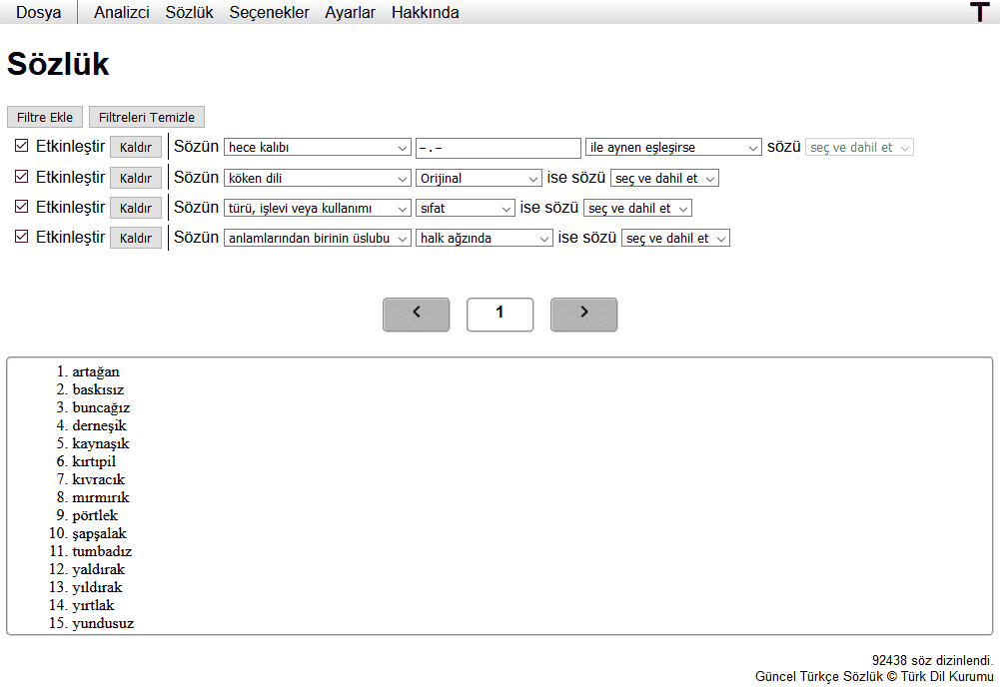

[taktisyen]: https://taktisyen.tk/

# [taktisyen]
Taktisyen: Syllabication and analysis of Turkish poems written in aruz prosody.

Taktisyen is a project that aims to make writing poems with aruz prosody easier
and more manageable. Taktisyen could also be used in schools to make students
see patterns that may be difficult to notice otherwise.


Our dictionary can be used to find words that fill complicated conditions very
easily. Users can filter words by syllables, origin language, tone of voice and
so much more very easily!



## Building

Issue these commands:

```bash
$ git clone git@github.com:EmreOzcan/taktisyen.git
$ cd taktisyen
$ npm install
$ npm run build
```

The output files will be put under `/public/build`.

## License

taktisyen's source code is provided under the [MIT License](./LICENSE).

Copyright © 2021 Emre Özcan
