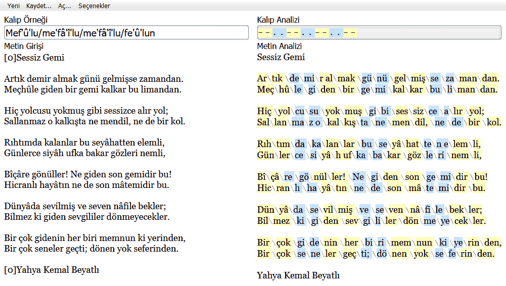

[taktisyen]: https://taktisyen.vercel.app/

# [taktisyen]
Taktisyen: Syllabication and analysis of Turkish poems written in aruz prosody.

Taktisyen is a project that aims to make writing poems with aruz prosody easier
and more manageable. Taktisyen could also be used in schools to make students
see patterns that may be difficult to notice otherwise.



## Building

The recommended way to install is via npm and grunt.

```bash
$ git clone git@github.com:EmreOzcan/taktisyen.git
$ cd taktisyen
$ npm install
$ grunt
```

*(You can issue `$ grunt debug` instead of just `$ grunt` to skip the
minification and Babel steps.)*

The output files will be put under `/dist`.
You can also just compile the SCSS file, combine the JavaScript files and put
them next to the HTML file.

## License

taktisyen's source code is provided under the [MIT License](./LICENSE).

Copyright © 2021 Emre Özcan
